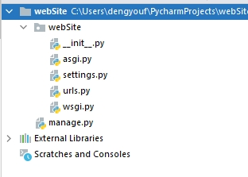
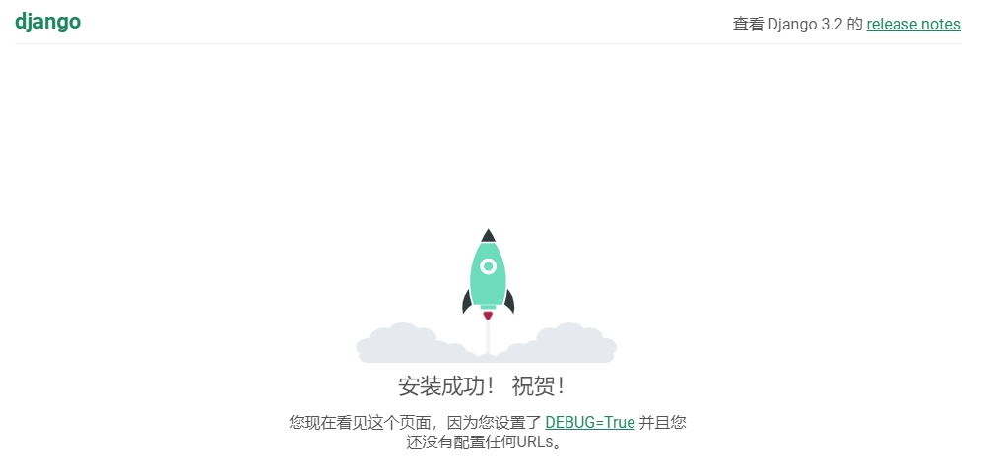

# Django基础

## Django框架的介绍

### 起源&现状

- 2005年发布,采用Python语言编写的开源web框架
- 一个重量级的 Python Web框架，Django 配备了常用的大部分组件
  1. 基本配置
  1. 路由系统
  1. 原生HTML模板系统
  1. 视图 view
  1. Model模型,数据库连接和ORM数据库管理
  1. 中间件
  1. Cookie & Seesion
  1. 数据库后台管理系统admin
- Django的用途
  - 网站后端开发
  - 微信公众号、微信小程序等后台开发
  - 基于HTTP/HTTPS协议的后台服务器开发
    - 在线语音/图像识别服务器
    - 在线第三方身份验证服务器等
- Django的官网
  - 官方网址: <http://www.djangoproject.com>
  - 中文文档(第三方):
    - <https://docs.djangoproject.com/zh-hans/5.0/>


## 快速入门

### Django安装

- 安装
  1. 在线安装
     - 安装django的最新版本： `sudo pip3 install django`  
     - 安装django的指定版本： `$ sudo pip3 install django[==版本]` 
     - 如: `$ sudo pip3 install django==3.2.13`
     > 使用 `-i`参数 通过 ` http://mirrors.aliyun.com/pypi/simple/`阿里云pypi仓库进行安装
  2. 离线安装
     - 官网下载安装包:
     - 安装离线包
       - `$ tar -zxvf Django-3.2.13.tar.gz`
       - `$ cd Django-3.2.13`
       - `$ sudo python3 setup.py install`

> Django 3.2.13 支持 3.6，3.7，3.8，3.9，3.10

- 查看版本

```python
$ python -m django --version
3.2.13
```

- 卸载

```python
sudo pip3 uninstall django
```

### 创建项目

- $ django-admin startproject 项目名称 


```python
django-admin.exe  startproject webSite .
```
> `.` 表示在Pycharm已经打开的当前目录下，直接创建目录


- 创建项目后，会生成如下目录结构



  - `manage.py`：项目管理的主程序,在开发阶段用于管理整个项目的开发运行的调式

    - `manage.py` 包含项目管理的子命令, 如:
    ```python
    python3 manage.py runserver 启动服务
    python3 manage.py startapp 创建应用
    python3 manage.py migrate 数据库迁移
    ...
    ```
    
  - webSite为项目文件夹

    - 项目包的主文件夹(默认与项目名称一致)

    -  `__init__.py`： 包初始化文件,当此项目包被导入(import)时此文件会自动运行
    - `wsgi.py`： WSGI 即 Web Server Gateway Interface， WEB服务网关接口的配置文件，仅部署项目时使用
    - `urls.py`： 项目的主路由配置文件，所有的动态路径必须先走该文件进行匹配
    - `settings.py`： Django项目的配置文件, 此配置文件中的一些全局变量将为Django框架的运行传递一些参数
        - setting.py 配置文件,启动服务时自动调用，
        - 此配置文件中也可以定义一些自定义的变量用于作用全局作用域的数据传递
    5. `asgi.py`： 对现有WSGI支持的补充。Django打算在可预见的未来支持这两个项目。目前异步功能将仅适用于在ASGI下运行的应用程序。

### 启动项目

$ python manage.py runserver [HOST:PORT]

```python
python manager runserver 
```



### 配置文件settings.py剖析

> [官网](ttps://docs.djangoproject.com/en/3.2/ref/settings/): `https://docs.djangoproject.com/en/3.2/ref/settings/`


- `BASE_DIR`: 用于绑定当前项目的绝对路径(动态计算出来的), 所有文件都可以依懒此路径

- `DEBUG`: 用于配置Django项目的启动模式
    - True 表示开发环境中使用 `调试模式`(用于开发中)
    - False 表示当前项目运行在`生产环境中`(不启用调试)


    
- `ALLOWED_HOSTS`: 设置允许访问到本项目的host请求头的值
    - [] 空列表,表示只有host请求头为`127.0.0.1`, `localhost`能访问本项目 
        - DEBUG = True时生效
    - ['*']，表示任何请求头的host都能访问到当前项目
    - ['192.168.1.3', '127.0.0.1'] 表示只有当前两个host头的值能访问当前项目

> 如果要在局域网其它主机也能访问此主机,启动方式应使用如下模式:

> - `python3 manage.py runserver 0.0.0.0:5000` 
> - 指定网络设备如果内网环境下其他主机想正常访问该站点，需`ALLOWED_HOSTS = ['内网ip'] 

- `INSTALLED_APPS`: 指定当前项目中安装的应用列表

- `MIDDLEWARE`: 用于注册中间件

- `TEMPLATES`: 用于指定模板的配置信息

- `DATABASES`: 用于指定数据库的配置信息

- `LANGUAGE_CODE`: 用于指定语言配置
     - 英文 : `"en-us"`
     - 中文 : `"zh-Hans"`

- `TIME_ZONE`: 用于指定当前服务器端时区
     - 世界标准时间: `"UTC"`
     - 中国时区 : `"Asia/Shanghai"`

- `ROOT_URLCONF`: 用于配置根级 url 配置 'webSite.urls'
      - `ROOT_URLCONF = 'webSite.urls'`

> 注: 此模块可以通过 `from django.conf import settings` 导入和使用

## 路由配置

### url介绍

URL 即统一资源定位符 Uniform Resource Locator，主要用来标识互联网上某个资源的地址。互联网上的每个文件都有一个唯一的URL，它包含的信息指出文件的位置以及浏览器应该怎么处理它。

- URL的组成:

```
protocol :// hostname[:port] / path [?query][#fragment]
```

- 如:

  ```
  http://tts.tmooc.cn/video/showVideo?menuId=657421&version=AID201908#subject
  ```

  - protocol（协议）
    - http 通过 HTTP 访问该资源。 格式 `http://`
    - https 通过安全的 HTTPS 访问该资源。 格式 `https://`
    - file 资源是本地计算机上的文件。格式: `file:///`
    - ...

  - hostname（主机名）
    - 是指存放资源的服务器的域名系统(DNS) 主机名、域名 或 IP 地址。

  - port（端口号）
    - 整数，可选，省略时使用方案的默认端口；
    - 各种传输协议都有默认的端口号，如http的默认端口为80。
  - path（路由地址）
    - 由零或多个“/”符号隔开的字符串，一般用来表示主机上的一个目录或文件地址。路由地址决定了服务器端如何处理这个请求

  - query(查询)
    - 可选，用于给动态网页传递参数，可有多个参数，用“&”符号隔开，每个参数的名和值用“=”符号隔开。
  - fragment（信息片断）
    - 字符串，用于指定网络资源中的片断。例如一个网页中有多个名词解释，可使用fragment直接定位到某一名词解释。
  - 注: [] 代表其中的内容可省略

###  Django处理URL对应请求

#### 主路由文件说明

- settings.py 中的`ROOT_URLCONF` 指定了主路由配置列表urlpatterns的文件位置

- urls.py 主路由配置文件

  ```python
  # file : <项目同名文件夹>/urls.py
  urlpatterns = [
      path('admin/', admin.site.urls),
      ...  # 此处配置主路由
  ]
  ```
#### path() 函数

用于描述路由与视图函数的对应关系

- 模块： `from django.urls import path`
- 语法:
```
path(route, views, name=None)
  参数：
    1. route: 字符串类型，匹配的请求路径
    2. views: 指定路径所对应的视图处理函数的名称
    3. name: 为地址起别名，在模板中地址反向解析时使用
```
#### 案例说明

```python
浏览器  http://127.0.0.1:8000/page/1016/

1,Django 从配置文件中 根据 ROOT_URLCONF 找到 主路由文件；默认情况下，该文件在 项目同名目录下的urls; 例如 webSite/webSite/urls.py
2,Django 加载 主路由文件中的 urlpatterns 变量
3,依次匹配 urlpatterns 中的 URL， 匹配到第一个合适的中断后续匹配
4,匹配成功 - 调用对应的视图函数处理请求，返回响应
5,匹配失败 - 返回404响应

主路由-urls.py样例
from django.urls import path
from . import views

urlpatterns = [
    path('admin/', admin.site.urls)
    path('page/1001/', views.page_1001),
    path('page/1002/', views.page_1002),
]
```

#### 视图函数(view)

视图函数是用于接收一个浏览器请求并通过HttpResponse对象返回数据的函数。此函数可以接收浏览器请求并根据业务逻辑返回相应的内容给浏览器

```python
  def xxx_view(request[, 其它参数...]):
      return HttpResponse对象
```

- 参数
    - request用于绑定HttpRequest对象，通过此对象可以获取浏览器的参数和数据
- 返回值
    - HttpResponse的对象；Django会提供一系列的response对象


## 实战HelloWorld

### 1. 新增主视图文件`webSite/views.py`添加视图函数

```
# 定义视图函数
from django.http import HttpResponse

def hello(request):
    return HttpResponse("Hello World")
```
### 2. 在主路由配置文件`webSite/urls.py`中添加路由

```
from django.contrib import admin
from django.urls import path

from webSite import views # 导如视图文件

urlpatterns = [
    path('admin/', admin.site.urls),
    path('hello/', views.hello, name="hello"), # 添加路由
]
```

### 3. 启动项目并访问:`http://127.0.0.1:8000/hello/`


