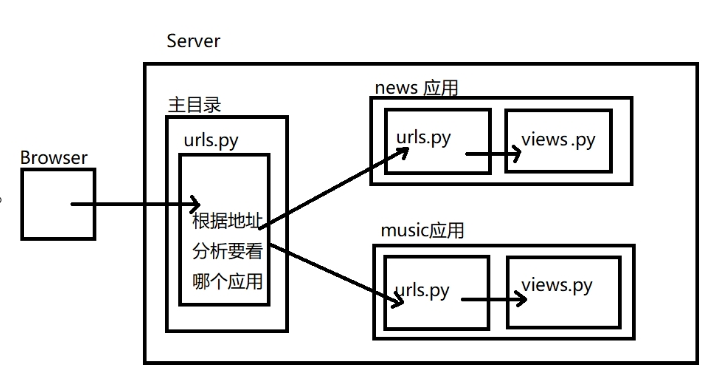

# Django路由

>[官网](https://docs.djangoproject.com/en/3.2/topics/http/urls/): `https://docs.djangoproject.com/en/3.2/topics/http/urls/`

## 1. 概述

Django路由是Django框架中用于处理请求的模块，它负责将请求路径映射到对应的视图函数。


## 2. 路由配置

### 2.1 简单路由配置

**案例**：`http://127.0.0.1:8000/hello/`

1. 在`urls.py`中添加路由配置

```python
from django.contrib import admin
from django.urls import path

from webSite import views

urlpatterns = [
    path('admin/', admin.site.urls),
    path('', views.hello, name="hello"),
]
```

2. 在`views.py`中添加视图函数

```python
from django.http import HttpResponse

def hello(request):
    return HttpResponse("<h1>Hello World</h1>")
```

### 2.2 路由参数

路由参数通过转换器实现，转换器用来匹配对应类型的数据，如果参数匹配则将数据按照传参的方式传递给视图函数, 如果参数匹配失败，则报错

| 转换器 | 效果                                                      | 案例                                                |
| ------ | --------------------------------------------------------- | --------------------------------------------------- |
| str    | 匹配除了 `'/'` 之外的非空字符串                           | "v1/users/\<str:username>"匹配 /v1/users/guoxiaonao |
| int    | 匹配0或任何正整数。返回一个 int                           | "page/\<int:page>" 匹配 /page/100                   |
| slug   | 匹配任意由 ASCII 字母或数字以及连字符和下划线组成的短标签 | "detail/\<slug:sl>" 匹配 /detail/this-is-django     |
| path   | 匹配非空字段，包括路径分隔符 `'/'`                        | "v1/users/\<path:ph>"匹配 /v1/goods/a/b/c           |

**案例**： `http://127.0.0.1:8000/book/20`

1. 在`urls.py`中添加路由配置

```python
from django.contrib import admin
from django.urls import path

from webSite import views

urlpatterns = [
    path('admin/', admin.site.urls),
    path('book/<int:id>', views.book, name="book"),
]
```

2. 在`views.py`中添加视图函数

```python
from django.http import HttpResponse

def book(request, id):
    return HttpResponse("this book number is {}".format(id))
```

### 3. 请求参数

无论是GET还是POST，统一都由视图函数接收请求，通过判断request.method 区分具体的请求动作

```python
  if request.method == 'GET':
      处理GET请求时的业务逻辑
  elif request.method == 'POST':
      处理POST请求的业务逻辑
  else:
      其他请求业务逻辑
```


**案例**：
```
GET请求： http://127.0.0.1:8000/req_view/?name=dengyouf&age=18
POST请求：curl --location --request POST 'http://127.0.0.1:8000/req_view/' \
--form 'name="dengyouf"' \
--form 'age="38"' 
```

1. 在`urls.py`中添加路由配置
```python
from django.contrib import admin
from django.urls import path

from webSite import views

urlpatterns = [
path('admin/', admin.site.urls),  
    path('req_view/>', views.req_view, name="req_view"),
]
```
2. 在`views.py`中添加视图函数
```
def req_view(request):
    if request.method == "GET":
        try:
            name = request.GET.get("name")
            age = request.GET.get("age")
            return HttpResponse("GET 姓名:{};年龄:{}".format(name, age))
        except Exception as e:
            return HttpResponse(e)
    else:
        request.method == "POST"
        try:
            name = request.POST.get("name")
            age = request.POST.get("age")
            return HttpResponse("POST 姓名:{};年龄:{}".format(name, age))
        except Exception as  e:
            return  HttpResponse(e)

```

 > 由于csrf验证,Django将会拒绝客户端发来的POST请求，可以注释掉 settings.py 中 MIDDLEWARE 中的 CsrfViewsMiddleWare 的中间件 


## 3. 路由分组

主路由配置文件(urls.py)可以不处理用户具体路由，主路由配置文件的可以做请求的分发(分布式请求处理)。具体的请求可以由各自的应用来进行处理，路由分组可以更好的管理路由，并且可以更好的复用路由



**include 函数**

- 作用：
    - 用于分发将当前路由转到各个应用的路由配置文件的 urlpatterns 进行分布式处理
- 函数格式：
    - include(urlpatterns)

**案例**
```
http://127.0.0.1:8000/news/list
http://127.0.0.1:8000/music/list
```

1. 创建两个应用 news 和 music
```shell
python manage.py  startapp news
python manage.py  startapp music
```
2. 在主配置文件 settings.py 中添加应用
```python
INSTALLED_APPS = [
    'django.contrib.admin',
    ...
    'news',
    'music',
]
```

3. 在主路由配置文件中定义路由分组
```
from django.contrib import admin
from django.urls import path,include

from webSite import views
urlpatterns = [
    path('admin/', admin.site.urls),
    path('', views.hello, name="hello"),
    path('book/<int:id>', views.book, name="book"),

    path('req_view/', views.req_view, name="req_view"),

    path('news/', include("news.urls")),
    path('music/', include("music.urls")),
]
```

4. 分别在应用news和music中创建路由配置文件 urls.py
```python
# news.urls.py
from django.urls import path
from . import views

urlpatterns = [
    path('list/', views.list, name="news_list"),
]

# music.urls.py
from django.urls import path
from . import views

urlpatterns = [
    path('list/', views.list, name="news_list"),
]
```

5. 在应用news和music中创建视图函数 views.py
```python
# news.views.py
from django.http import HttpResponse
from django.shortcuts import render

def list(request):
    return HttpResponse("news list")

# music.views.py
from django.http import HttpResponse
from django.shortcuts import render

def list(request):
    return HttpResponse("music list")
```


